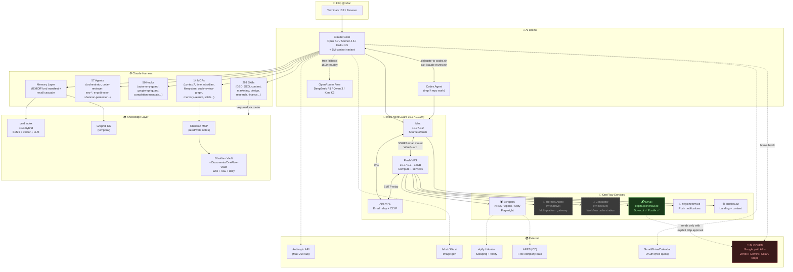

# OneFlow / Filip — Ekosystém ke 2026-05-03

> Snapshot živé architektury napříč Mac + 2 VPS + Claude Code harness + Codex bridge + OneFlow services + AI providers + memory/knowledge layer.
> Verified live: skills 293 / agents 57 / hooks 50 / MCPs 14. Flash services: dovecot ✅ postfix ✅ hermes 💤 conductor 💤.

---

## 1) High-level layered view (ASCII)

```
┌──────────────────────────────────────────────────────────────────────────────────────┐
│                           👤 FILIP @ Mac (source of truth)                           │
│                            Terminal · IDE · Browser · Obsidian                       │
└────────┬─────────────────────────────────────────────────────────────┬───────────────┘
         │                                                              │
         ▼                                                              ▼
┌───────────────────────────┐                              ┌─────────────────────────┐
│   🧠 CLAUDE CODE HARNESS   │                              │   📦 CODEX BRIDGE       │
│   (orchestrator + brain)   │ ◀─── delegate-to-codex.sh ──▶│   (impl + repo agent)   │
│                           │                              │                         │
│  Models:                  │                              │  Mode: auto/lean/full   │
│   • Opus 4.7 (architecture│                              │  Scripts:               │
│   • Opus 4.7 1M (mega)    │                              │   • delegate-to-codex   │
│   • Sonnet 4.6 (default)  │                              │   • ask-claude-review   │
│   • Haiku 4.5 (subagents) │                              │   • ask-claude-strategy │
│                           │                              │   • route-task / ofs    │
│  Free fallback (OpenRouter│                              │   • doctor / scan       │
│   → DeepSeek R1, Qwen 3   │                              │   • obsidian-dashboard  │
│     Coder, Kimi K2,       │                              │   • verify-10-10        │
│     Nemotron Nano)        │                              │                         │
│                           │                              │                         │
│  Harness:                 │                              │  HARD-STOP zone honored │
│   • 293 skills            │                              │  (no secrets in handoff)│
│   • 57 agents             │                              └─────────────────────────┘
│   • 50 hooks              │
│   • 14 MCPs               │
│   • Memory + recall       │
└───────────┬───────────────┘
            │
            ▼
┌──────────────────────────────────────────────────────────────────────────────────────┐
│                          🔐 INFRA LAYER (WireGuard 10.77.0.0/24)                     │
│                                                                                      │
│   Mac (10.77.0.2)  ◀───── SSHFS /mac mount ─────▶  Flash VPS (10.77.0.1, 12 GB)     │
│                                                                                      │
│   Source of truth                                  Compute + services                │
│    • ~/Documents                                    • Hermes Agent (💤 inactive)     │
│    • ~/.claude (293 skills)                         • Conductor (💤 inactive)        │
│    • OneFlow-Vault (Obsidian)                       • Dovecot ✅ (mailbox)           │
│    • ~/.credentials                                 • Postfix ✅ (SMTP relay)        │
│                                                     • Scrapers (Apify, Playwright)   │
│                                                     • ntfy.oneflow.cz               │
│                                                     • errors.oneflow.cz (planned)    │
│                                                     • file.oneflow.cz (planned)      │
│                                                                                      │
│                                              Alfa VPS (email + CZ IP relay)         │
│                                                     • Wedos legacy archive           │
│                                                     • SMTP submission backup         │
└──────────────────────────────────────────────────────────────────────────────────────┘
            │
            ▼
┌──────────────────────────────────────────────────────────────────────────────────────┐
│                          🧠 KNOWLEDGE / MEMORY LAYER                                 │
│                                                                                      │
│  Auto-loaded:                       Lazy-loaded (router):           Persistent:      │
│   • CLAUDE.md (TOP RULES)            • knowledge-router.md           • Obsidian Vault│
│   • MEMORY.md (manifest)             • workflow-routing.md            (~/Documents/  │
│   • RTK.md                           • oneflow-all.md                 OneFlow-Vault) │
│   • rules/anti-hallucination         • lean-engine.md                • memory/*.md   │
│   • rules/completion-mandate         • reasoning-depth.md            • graphiti KG   │
│   • rules/prompt-completeness        • codex-bridge-routing.md       • qmd index     │
│   • rules/hard-stop-zone             • cost-zero-tolerance.md         (4GB hybrid    │
│                                                                       BM25+vector)   │
│                                                                                      │
│  Recall cascade: grep MEMORY → memory-search MCP → Obsidian → graphiti              │
└──────────────────────────────────────────────────────────────────────────────────────┘
            │
            ▼
┌──────────────────────────────────────────────────────────────────────────────────────┐
│                          🌐 EXTERNAL TOUCHPOINTS                                     │
│                                                                                      │
│   Send:                          Read:                       Compute/AI:             │
│    • Email (dopita@oneflow.cz)   • ARES (free CZ company)    • Anthropic API         │
│    • ntfy push (Filip)           • Apollo (deprecated post   • OpenRouter (free)     │
│    • WhatsApp (READ-ONLY)          2026-09 — use direct)     • fal.ai (image)        │
│    • LinkedIn (Voyager)          • Apify (public scrape)     • Kie.ai (image, free)  │
│    • Slack/Telegram (Hermes)     • Hunter.io (email verify)  • OpenAlex/arxiv        │
│                                  • CrUX/GSC/GA4 (Google      • NotebookLM (research) │
│   🛑 BLOCKED (cost-zero):         OAuth — free quota)         • HuggingFace          │
│    • Google Solar / Maps                                                             │
│    • Vertex / Gemini paid                                                            │
│    • Gemini API (any tier)                                                           │
└──────────────────────────────────────────────────────────────────────────────────────┘
```

---

## 2) Mermaid flowchart (renderable v Obsidian / GitHub / Mermaid Live)



---

## 3) Critical paths (jak co teče)

| Use case | Path |
|---|---|
| **Filip zadá impl task** | Filip → Claude Code → `delegate-to-codex.sh` → Codex → soubory v repu → (optional) `ask-claude-review.sh` → Claude review → commit |
| **Filip zadá strategy/text task** | Filip → Claude Code (přímo, bez Codexu) → output |
| **Recall ("co jsem řešil X")** | Claude → grep MEMORY.md → memory-search MCP → Obsidian search → graphiti KG |
| **DD report / klientský deliverable** | Claude → /evalopt loop (Gemini→OpenRouter free, ≥85 score) → Filip approval → ship |
| **Cold email / outreach** | Claude → `outreach-oneflow` skill → 9-bod pre-send checklist → Filip approval → Postfix Flash → recipient |
| **Lead enrichment** | Claude → ARES (CZ free) + Hunter (verify) + Apollo direct (deprecated post 2026-09 → migrate) → CRM/Sheets |
| **Content (IG carousel/reel)** | Claude → `ig-content-creator` skill → /evalopt brand voice → huashu-design hi-fi → publish |
| **Pentest / security audit** | Claude → `shannon` skill → Flash VPS → exploit attempts → blue-team auto-chain → audit verdict |
| **Vault search** | Claude → `qmd` skill (CLI) → 4GB hybrid index → BM25 + vector + LLM rerank |
| **External AI watchlist** | Claude → `ai-radar --scope=external` → cherry-pick → MEMORY append → /apply-improvements |

---

## 4) Hard-stop zóna (jediné domény, kde Claude se ptá)

1. **Platby / cost generation** → cost-zero-tolerance.md (Google paid APIs = HARD BAN po 2026-04-27)
2. **Odeslání zpráv** → email/WA/SMS/Slack/Telegram/LinkedIn (READ-ONLY default)
3. **Nevratná destrukce** → DROP, force push main, rm -rf prod
4. **FB/Meta login** → fb-scrape-safety.md (Tier 1 alternativy = auto-allow)
5. **Strategy >100k Kč / legal binding** → CNB filing, hire/fire, equity changes

Vše ostatní = Claude rozhodne sám → dokončí → reportuje.

---

## 5) Provozní stav (live snapshot)

| Komponenta | Stav | Pozn. |
|---|---|---|
| Mac harness (skills/agents/hooks/MCPs) | ✅ 293 / 57 / 50 / 14 | W7 closure 2026-05-03 |
| Flash dovecot | ✅ active | mailbox dopita@oneflow.cz |
| Flash postfix | ✅ active | SMTP relay |
| Flash hermes | 💤 inactive | installed, není auto-start |
| Flash conductor | 💤 inactive | workflow orchestrace, pause |
| Codex bridge | ✅ 18 scripts | delegate / review / strategy / ofs |
| Memory layer | ✅ 10 entries | post-W7 manifest |
| Audit health | 🟢 HEALTHY | 2026-05-03 první 0 warnings |
| Anthropic SDK upgrade 0.87→0.97 | ✅ done | Managed Agents Memory ready |
| Gemini ban | 🛑 enforced | hook v3 + sandbox + cron disabled |

---

## 6) Známé gaps / next moves

- 💤 **Hermes** + **Conductor** inactive → rozhodnout: enable on boot vs. retire
- 📦 **Beads / chibisafe / GlitchTip** = SHOULD CONSIDER, neinstalováno
- 🔄 **Apollo deprecation 2026-09** → migrate na direct Apollo official scraper paid (cost approval needed)
- 📊 **errors.oneflow.cz** (GlitchTip) + **file.oneflow.cz** (chibisafe) = planned subdomény, neexistují
- 🧪 **Managed Agents Memory v0.97** = ready, eval jako Conductor replacement Q3 2026

---

*Generated 2026-05-03 · Source: live filesystem + MEMORY.md + audit history*
*Update cmd: `/audit-system` (full scan) or refresh manually after major topology change.*
